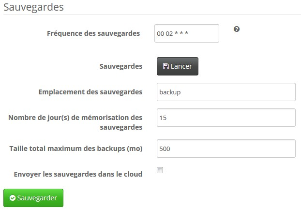
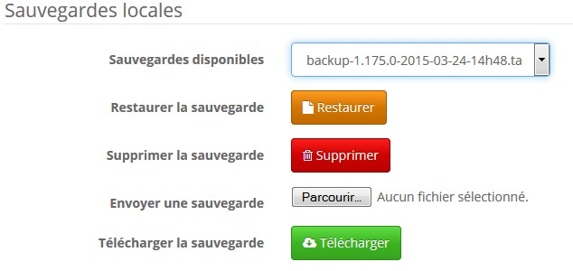
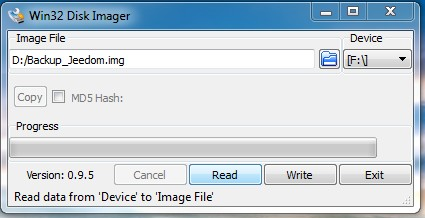

Description
===========

Il y a deux manières de sauvegarder Jeedom et chacune comporte des
avantages et des inconvénients.

Il est possible de réaliser une sauvegarde à partir de l’interface
Jeedom, cette sauvegarde concerne uniquement le logiciel Jeedom et ses
données. Elle a l’avantage de pouvoir être faite à chaud et le fichier
de sauvegarde peut être exporté vers d’autres supports.

Il est aussi possible de réaliser une sauvegarde en faisant une image
disque de la carte microSD (mini et mini+). Elle a l’avantage d'être une
sauvegarde complète du système ainsi que de Jeedom et ses données. Par
contre il faut l’effectuer en éteignant Jeedom et en branchant la carte
microSD sur un autre ordinateur.

Le meilleur moyen d'être tranquille est d’utiliser les deux : Faire une
sauvegarde de la carte microSD de temps en temps et programmer une
sauvegarde régulière de Jeedom.

> **Tip**
>
> La procédure de restauration de la carte microSD peut-être utile pour
> restaurer un Jeedom par défaut à partir de l’image fournie par
> l'équipe voir
> [ici](https://www.jeedom.fr/doc/documentation/installation/fr_FR/doc-installation.html).

Sauvegarde/Restauration de Jeedom
=================================

Afin de gérer et paramétrer les sauvegardes, il faut se rendre dans le
menu *Général \> Administration \> Sauvegardes*.

Configurations
--------------

1.  Paramètres Généraux

    -   Fréquence des sauvegardes ° : Permet de définir la fréquence à
        laquelle Jeedom va automatiquement lancer une sauvegarde de
        lui-même. Exemple : `00 02 * * *` : Lance une sauvegarde tous
        les jours à 02h00 du matin.

    -   Sauvegardes : Le bouton *Lancer* permet de lancer manuellement
        une sauvegarde de Jeedom.

    -   Emplacement des sauvegardes ° : Permet de modifier le répertoire
        de destination des fichiers de sauvegarde. (Par défaut :
        `backup`) Le chemin est relatif par rapport à l’arborescence de
        Jeedom (`/usr/share/nginx/www/jeedom/`)

    -   Nombre de jour(s) de conservation des sauvegardes ° : Permet de
        définir le temps de rétention des fichiers de sauvegarde. Les
        fichiers de sauvegarde plus vieux que ce paramètre seront
        automatiquement supprimés.

    -   Taille totale maximum d’une sauvegarde (Mo) ° : Permet de
        limiter la taille du fichier de sauvegarde. Si la sauvegarde
        créée un fichier plus gros que cette taille, elle se met en
        erreur et vous prévient par une alerte.

    -   Envoyer les sauvegardes dans le cloud : Une fois cette case
        cochée, les sauvegardes seront automatiquement envoyées sur les
        serveurs cloud de Jeedom. Attention : Cette option nécessite
        l’achat d’un abonnement à partir de votre profil du market.

Ne pas oublier de cliquer sur le bouton vert *Sauvegarder* afin
d’enregistrer les changements de configuration.

*Remarque: Les paramètres suivis d’un ° sont uniquement disponibles en
mode expert.*



> **Tip**
>
> Afin que Jeedom fasse automatiquement une sauvegarde avant les mises à
> jour, il y a une case à cocher (*"Faire une sauvegarde avant la mise à
> jour"*) dans la section *"Market et mise à jour"* du menu *Général \>
> Administration \> Configuration*.

1.  Sauvegardes locales

    -   Sauvegardes disponibles : Permet de voir et sélectionner le
        fichier de sauvegarde locale qui sera utilisé pour les actions
        sur les boutons suivants.

    -   Restaurer la sauvegarde : Le bouton *Restaurer* permet de lancer
        une restauration de Jeedom en utilisant le fichier de sauvegarde
        sélectionné dans la liste *Sauvegardes disponibles*.

    -   Supprimer la sauvegarde : Le bouton *Supprimer* permet de
        supprimer le fichier de sauvegarde sélectionné dans la liste
        *Sauvegardes disponibles*.

    -   Télécharger la sauvegarde : Le bouton *Télécharger* permet de
        récupérer sur son ordinateur le fichier de sauvegarde
        sélectionné dans la liste *Sauvegardes disponibles*.

    -   Envoyer une sauvegarde : Permet de réinjecter dans Jeedom un
        fichier de sauvegarde que vous auriez téléchargé sur votre
        ordinateur, afin de pouvoir l’utiliser pour restaurer Jeedom.

        

2.  Sauvegardes cloud

    -   Sauvegardes disponibles : Permet de voir et sélectionner le
        fichier de sauvegarde disponible sur le cloud qui sera utilisé
        pour la restauration.

    -   Restaurer la sauvegarde : Le bouton *Restaurer* permet de lancer
        une restauration de Jeedom en utilisant le fichier de sauvegarde
        sélectionné dans la liste *Sauvegardes disponibles*.

        

> **Important**
>
> Afin de pouvoir utiliser la sauvegarde sur le cloud vous devez acheter
> un abonnement à partir de votre profil sur le market Jeedom. Vous
> pouvez aussi à cet endroit voir et récupérer les fichiers de
> sauvegarde disponible.


Sauvegarde
----------

On a vu que l’on peut configurer Jeedom afin qu’il se sauvegarde
automatiquement à intervalle régulier mais aussi avant de lancer des
mises à jour. Afin de lancer une sauvegarde manuellement se rendre dans
le menu *Général \> Administration \> Sauvegardes*, cliquer sur le
bouton gris *Lancer*, et attendre que Jeedom vous annonce par un bandeau
vert que la sauvegarde s’est bien terminée. Un log, sur la droite de la
page, vous permet de suivre l’avancement.

Une fois la sauvegarde terminée, vous pouvez récupérer le fichier sur
votre ordinateur. Si vous avez acheté un abonnement sauvegarde cloud, le
fichier sera automatiquement envoyé sur les serveurs cloud de Jeedom.
Vous pouvez aussi utiliser le plugin Data Transfert afin de copier ces
fichiers sur un serveur FTP, SFTP, Dropbox…

Restauration
------------

La restauration est aussi simple que la sauvegarde.

Pour une restauration à partir d’une sauvegarde présente, sélectionner
le fichier de sauvegarde correspondant à la date voulue dans la liste
*Sauvegardes disponibles* (Sauvegardes locales ou Sauvegardes cloud),
puis cliquer sur *Restaurer*, et attendre que Jeedom vous annonce par un
bandeau vert que la restauration s’est bien terminée. Un log, sur la
droite de la page, vous permet de suivre l’avancement.

Si vous venez de réinstaller complètement votre mini+ (Par exemple à
partir d’une image microSD vierge), avant de lancer une restauration
vous devez au préalable envoyer un fichier de sauvegarde de votre
ordinateur vers Jeedom en utilisant la fonction *Envoyer une sauvegarde*
de la section *Sauvegardes locales*.

Sauvegarde/Restauration de la carte microSD
===========================================

Préparatifs
-----------

Ces sauvegardes/restaurations se réalisent à partir d’un autre
ordinateur afin de faire une "image propre" de la carte SD. Il faut dans
un premier temps arrêter la mini+. Pour cela, passer Jeedom en mode
expert dans le menu utilisateur en haut à droite.


Et cliquer sur Éteindre


Ensuite, il faut sortir la carte microSD de la mini+ et la connecter à
votre ordinateur via un adaptateur/lecteur de carte/…


Sous Windows
------------

Il faudra commencer par télécharger un logiciel tiers par exemple :
[Win32 Disk Imager](http://sourceforge.net/projects/win32diskimager/)

1.  Sauvegarde

Lancer le logiciel et vérifier que la lettre en dessous de *Device*
corresponde bien à celle de votre carte/lecteur de carte.

Dans le champ *Image File*, indiquer le nom du fichier image que vous
voulez créer ainsi que l’endroit où il sera enregistré.

Enfin cliquer sur le bouton *Read*, afin de créer l’image.



1.  Restauration

Lancer le logiciel et vérifier que la lettre en dessous de *Device*
corresponde bien à celle de votre carte/lecteur de carte.

Dans le champ *Image File*, allez chercher le fichier image que vous
voulez restaurer.

Enfin cliquer sur le bouton *Write*, afin de restaurer cette image sur
la carte microSD.


Sous MacOSX
-----------

Pour vous faciliter la tâche, vous pouvez télécharger le logiciel
[ApplePi-Baker](http://www.tweaking4all.com/hardware/raspberry-pi/macosx-apple-pi-baker/)


1.  Sauvegarde

    -   Avec ApplePi-Baker : Sélectionner la bonne carte dans la liste
        *Pi-Crust*, et cliquer sur *Create Backup* afin de créer un
        fichier image de votre carte microSD.

    -   En commande shell :

        -   Afin de trouver le disque correspondant à la carte, ouvrir
            un terminal et saisir la commande : *diskutil list*
            image::images/save-restore12.jpg[align="center"]

        -   Lancer la création de l’image en saisissant la commande :
            *sudo dd if=/dev/rdisk1 of=\~/Desktop/Backup\_Jeedom.img
            bs=1m*

*Remarque: Dans cet exemple, le nom du disque de la carte est
/dev/disk1, il faut donc saisir dans la commande de sauvegarde
/dev/rdisk1*

1.  Restauration

    -   Avec ApplePi-Baker : Sélectionner la bonne carte dans la liste
        *Pi-Crust*, mettre le chemin vers le fichier image à restaurer
        dans le champ *IMG file* de la section *Pi-Ingredients*, et
        cliquer sur *Restore Backup* afin de restaurer l’image sur la
        carte microSD.

    -   En commande shell :

        -   Afin de trouver le disque correspondant à la carte, ouvrir
            un terminal et saisir la même commande que pour la
            sauvegarde : *diskutil list*

        -   Démonter les partitions de la carte en tapant la commande :
            *sudo diskutil unmountDisk /dev/disk1*

        -   Restaurer l’image sur la carte microsd en tapant la commande
            : *sudo dd bs=1m if=\~/Desktop/Backup\_Jeedom.img
            of=/dev/rdisk1*

*Remarque: Dans cet exemple, le nom du disque de la carte est
/dev/disk1, il faut donc saisir dans la commande de sauvegarde
/dev/rdisk1*

Sous Linux
----------

1.  Sauvegarde

    -   Afin de trouver le disque correspondant à la carte, ouvrir un
        terminal et saisir la commande : *sudo fdisk -l | grep Dis*

``` {.bash}
$ sudo fdisk -l | grep Dis
Disk /dev/sda: 320.1 GB, 320072933376 bytes
Disk /dev/sdb: 16.0 GB, 16012804096 bytes
Disk /dev/sdc: 8.0 GB, 8006402048 bytes
```

-   Lancer la création de l’image en saisissant la commande : *sudo dd
    if=/dev/sdc of=Backup\_Jeedom.img bs=1m*

*Remarque: Dans cet exemple, le nom du disque de la carte est /dev/sdc.*

1.  Restauration

    -   Afin de trouver le disque correspondant à la carte, ouvrir un
        terminal et saisir la commande : *sudo fdisk -l | grep Dis*+

    -   Démonter les partitions de la carte en tapant la commande :
        *sudo umount /dev/sdc?\**

    -   Restaurer l’image sur la carte microsd en tapant la commande :
        *sudo dd if=Backup\_Jeedom.img of=/dev/sdc bs=1m*

*Remarque: Dans cet exemple, le nom du disque de la carte est /dev/sdc.*

